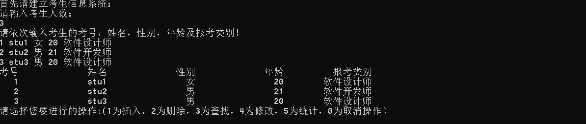
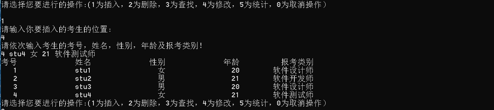
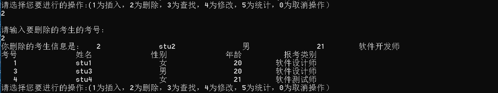
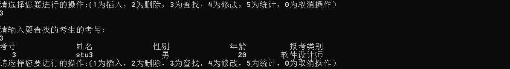
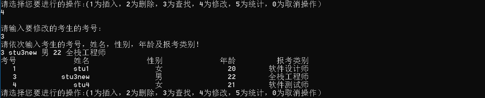
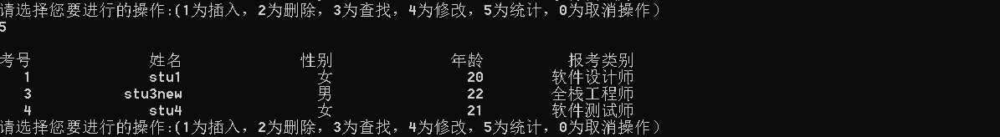
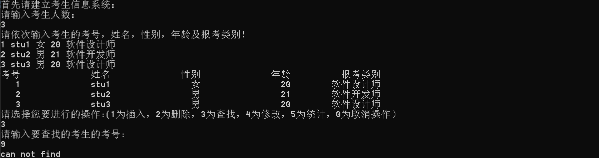
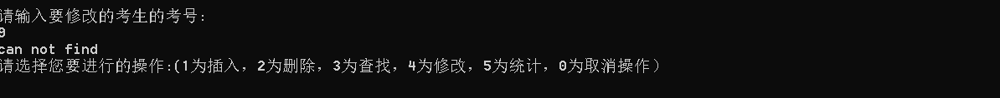

# 数据结构课程设计

#### 

## 考试报名系统项目说明文档

### 0.项目简介

 考试报名工作给各高校报名工作带来了新的挑战，给教务管理部门增加了很大的工作量。本项目是对考试报名管理的简单模拟，用控制台选项的选择方式完成下列功能：输入考生信息；输出考生信息；查询考生信息；添加考生信息；修改考生信息；删除考生信息。

- 项目功能要求：

本项目的实质是完成对考生信息的建立，查找，插入，修改，删除等功能。其中考生信息包括准考证号，姓名，性别，年龄和报考类别等信息。项目在设计时应首先确定系统的数据结构，定义类的成员变量和成员函数；然后实现各成员函数以完成对数据操作的相应功能；最后完成主函数以验证各个成员函数的功能并得到运行结果。（建议采用链表实现）

### 1.项目实现
- 建立考生信息
```c++
	void build() {
		int number;
		cout << "请输入考生人数：" << endl;
		cin >> number;
		LinkNode * p = sentinal;
		cout << "请依次输入考生的考号，姓名，性别，年龄及报考类别！" << endl;
		for (int i = 0; i < number; i++) {
			p->link = new LinkNode();
			p->link->input();
			p = p->link;
		}
		output();
	}
	
```



- 插入考生信息
```c++
bool insert(int index) {
		LinkNode * p = sentinal;
		//p为所插入位置的前驱指针
		for (int i = 1; i < index; i++) {
			if (p != NULL) {
				p = p->link;
			}
			else {
				return false;
			}
		}
		LinkNode * tmp = p->link;
		p->link = new LinkNode();
		cout << "请依次输入考生的考号，姓名，性别，年龄及报考类别！" << endl;
		p->link->input();
		p->link->link = tmp;
		output();
		return true;
	}
```


- 删除考生信息
```c++
void deleteitem(int id) {
		LinkNode * p = sentinal->link;
		LinkNode * prev = sentinal;
		while (p != NULL) {
			if (p->data.id == id) break;
			else {
				prev = p;
				p = p->link;
			}
		}
		if (p) {
			prev->link = p->link;
		}
		int space = 18;
		cout << "你删除的考生信息是: ";
		outputstud(p);
		delete p;
		output();
	}
```




- 查找考生信息
```c++
	LinkNode * search(int id) {
		LinkNode * p = sentinal->link;
		while (p != NULL) {
			if (p->data.id == id) {
				return p;
			}
			else {
				p = p->link;
			}	
		}
		cout << "can not find";
		return NULL;
	}
```



- 修改考生信息
```c++
	bool modify(int id) {
		LinkNode * p = search(id);
		if (p == NULL) {
			return false;
		}
		cout << "请依次输入考生的考号，姓名，性别，年龄及报考类别！" << endl;
		p->input();
		output();
		return true;
	}
```



- 统计考生信息
```c++
void outputstud(LinkNode *p) {
	int space = 18;
	cout << setw(4) << p->data.id << setw(space) << p->data.name << setw(space) << p->data.sex << setw(space) <<
		p->data.age << setw(space) << p->data.type << endl;
}
```


- 取消操作


### 2. 类及类成员介绍

- #### LinkNode类  

  - ##### 成员变量
  |成员名称|属性|类型|描述|
  |--------|---|---|----|
  |data|public|student|学生信息|
  |link|public|LinkNode * |指向下一个节点指针|

	
  - ##### 成员函数  
  |函数名称|返回值类型|描述|
  |--------|--------|----|
  |LinkNode|无|构造函数|
  |input|void|输入学生信息|

- #### List类  

  - ##### 成员变量
  |成员名称|属性|类型|描述|
  |--------|---|---|----|
  |sentinal|private|LinkNode * |表头结点|

	
  - ##### 成员函数  
  |函数名称|返回值类型|描述|
  |--------|--------|----|
  |List|无|构造函数|
  |~List|无|析构函数|
  |insert|bool|插入学生信息|
  |build|void|建立学生信息|
  |search|LinkNode * |查找学生|
  |deleteitem|void|删除学生|
  |modify|bool|修改学生信息|
  
### 2. 类的实现
- #### LinkNode类的实现

```c++
class LinkNode {
public:
	struct student data;
	LinkNode * link;
	LinkNode() :link(NULL) {}
	void input() {
		cin >> data.id
			>> data.name
			>> data.sex
			>> data.age
			>> data.type;
	}
};
```
- #### List类的实现
```c++
class List {
private:
	LinkNode * sentinal;
public:
	void output() {
		int space = 18;
		cout << "考号" << setw(space) << "姓名" << setw(space) << "性别" << setw(space) << "年龄"
			<< setw(space) << "报考类别" << endl;
		LinkNode * p = sentinal->link;
		while (p != NULL) {
			outputstud(p);
			p = p->link;
		}
	}
	List() {
		sentinal = new LinkNode();
	}
	~List() {
		LinkNode * p = sentinal;
		while (p->link != NULL) {
			LinkNode * tmp = p;
			p = p->link;
			delete p;
		}
	}
	bool insert(int index) {
		LinkNode * p = sentinal;
		//p为所插入位置的前驱指针
		for (int i = 1; i < index; i++) {
			if (p != NULL) {
				p = p->link;
			}
			else {
				return false;
			}
		}
		LinkNode * tmp = p->link;
		p->link = new LinkNode();
		cout << "请依次输入考生的考号，姓名，性别，年龄及报考类别！" << endl;
		p->link->input();
		p->link->link = tmp;
		output();
		return true;
	}
	void build() {
		int number;
		cout << "请输入考生人数：" << endl;
		cin >> number;
		LinkNode * p = sentinal;
		cout << "请依次输入考生的考号，姓名，性别，年龄及报考类别！" << endl;
		for (int i = 0; i < number; i++) {
			p->link = new LinkNode();
			p->link->input();
			p = p->link;
		}
		output();
	}
	void deleteitem(int id) {
		LinkNode * p = sentinal->link;
		LinkNode * prev = sentinal;
		while (p != NULL) {
			if (p->data.id == id) break;
			else {
				prev = p;
				p = p->link;
			}
		}
		if (p) {
			prev->link = p->link;
		}
		int space = 18;
		cout << "你删除的考生信息是: ";
		outputstud(p);
		delete p;
		output();
	}
	LinkNode * search(int id) {
		LinkNode * p = sentinal->link;
		while (p != NULL) {
			if (p->data.id == id) {
				return p;
			}
			else {
				p = p->link;
			}	
		}
		cout << "can not find";
		return NULL;
	}
	bool modify(int id) {
		LinkNode * p = search(id);
		if (p == NULL) {
			return false;
		}
		cout << "请依次输入考生的考号，姓名，性别，年龄及报考类别！" << endl;
		p->input();
		output();
		return true;
	}

};
```
# 3.实现具体说明

- 构造函数：将链表长度设置为 0

- 析构函数：释放结构体

- 插入函数：用户输入插入位置，插入方式为找到该位置，同时动态生成需要插入的数据

- 查找函数：根据用户插入的位置，建立一个头指针，依次从头寻找到该位置，将该位置考生的信息输出

- 删除函数：根据输入的考生的考号，先判断其位置，找到需要删除的结构体之后，对其前后指针进行操作，将其从链表中脱离出来，然后将其内存释放

- 编辑函数：根据输入的考生的考号，找到考生的位置，重新输入考生的信息

- 统计函数：对当前链表进行一次遍历，遍历过程中，输出考生信息

# 4.容错测试

- 查找不存在的考生时会输出can not find



- 修改不存在的考生时会输出can not find



- 命令不是0-5之间会要求重新输入


