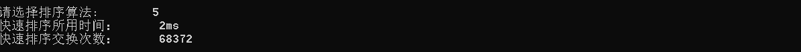

# 数据结构课程设计

#### 

## 8种排序算法的比较案例 项目说明文档

### 0.项目简介
随机函数产生一百，一千，一万和十万个随机数，用快速排序，直接插入排序，冒泡排序，选择排序的排序方法排序，并统计每种排序所花费的排序时间和交换次数。其中，随机数的个数由用户定义，系统产生随机数。并且显示他们的比较次数。
请在文档中记录上述数据量下，各种排序的计算时间和存储开销，并且根据实验结果说明这些方法的优缺点。

### 1.项目实现
#### 冒泡排序
- 冒泡排序：重复地走访过要排序的数列，一次比较两个元素，如果他们的顺序错误就把他们交换过来。走访数列的工作是重复地进行直到没有再需要交换，也就是说该数列已经排序完成。

```c++
void bubbleSort(int arr[]) {
	int temp, *test;
	int begin, end;

	test = new int[kNumber];
	memcpy(test, arr, sizeof(int) * kNumber);
	begin = clock();

	for (int i = 0; i < kNumber - 1; i++) {
		for (int k = 0; k < kNumber - 1 - i; k++) {
			if (test[k] > test[k + 1]) {
				temp = test[k];
				test[k] = test[k + 1];
				test[k + 1] = temp;
				kCount++;
			}
		}
	}
	end = clock();
	delete[] test;
	cout << "冒泡排序所用时间：      " << end - begin << "ms" << endl;
	cout << "冒泡排序交换次数：      " << kCount << endl;
	kCount = 0;
}
```


#### 选择排序
- 选择排序：每一次从待排序的数据元素中选出最小（或最大）的一个元素，存放在序列的起始位置，直到全部待排序的数据元素排完。

```c++
void selectionSort(int arr[]) {//wrong
	int temp, *test;
	int begin, end;

	test = new int[kNumber];
	memcpy(test, arr, sizeof(int) * kNumber);

	begin = clock();

	for (int i = 0; i < kNumber - 1; i++) {
		for (int k = i + 1; k < kNumber; k++) {
			if (test[i] > test[k]) {
				temp = test[i];
				test[i] = test[k];
				test[k] = temp;
				kCount++;
			}
		}
	}
	

	end = clock();
	delete[] test;
	cout << "选择排序所用时间：      " << end - begin << "ms" << endl;
	cout << "选择排序交换次数：      " << kCount << endl;
	kCount = 0;
}
```


#### 直接插入排序
- 直接插入排序：第一趟比较前两个数，然后把第二个数按大小插入到有序表中； 第二趟把第三个数据与前两个数从后向前扫描，把第三个数按大小插入到有序表中；依次进行下去，进行了(n-1)趟扫描以后就完成了整个排序过程。

```c++
void insertionSort(int arr[]) {
	int temp, *test, j;
	int begin, end;

	test = new int[kNumber];
	memcpy(test, arr, sizeof(int) * kNumber);

	begin = clock();

	for (int i = 1; i < kNumber; i++) {
		if (test[i] < test[i - 1]) {
			kCount++;
			temp = test[i];
			j = i - 1;
			do {
				test[j + 1] = test[j];
				j--;
			} while (j >= 0 && temp < test[j]);
			test[j + 1] = temp;
		}
	}

	end = clock();
	delete[] test;
	cout << "直接插入排序所用时间：      " << end - begin << "ms" << endl;
	cout << "直接插入排序交换次数：      " << kCount << endl;
	kCount = 0;
}
```

#### 希尔插入排序
- 希尔排序：把记录按下标的一定增量分组，对每组使用直接插入排序算法排序；随着增量逐渐减少，每组包含的关键词越来越多，当增量减至1时，整个文件恰被分成一组，算法便终止。

```c++
void shellSort(int arr[]) {
	int temp, *test, j, gap;
	int begin, end;

	gap = kNumber + 1;
	test = new int[kNumber];
	memcpy(test, arr, sizeof(int) * kNumber);
	begin = clock();
	do {
		gap = (gap / 3) + 1;
		for (int i = gap; i < kNumber; i++) {
			if (test[i] < test[i - gap]) {
				kCount++;
				temp = test[i];
				j = i - gap;
				do {
					test[j + gap] = test[j];
					j = j - gap;
				} while (j > 0 && temp < test[j]);
				test[j + gap] = temp;
			}
		}
	} while (gap > 1);
	end = clock();
	delete[] test;
	cout << "希尔排序所用时间：      " << end - begin << "ms" << endl;
	cout << "希尔排序交换次数：      " << kCount << endl;
	kCount = 0;
}
```

#### 快速排序
- 快速排序：通过一趟排序将要排序的数据分割成独立的两部分，其中一部分的所有数据都比另外一部分的所有数据都要小，然后再按此方法对这两部分数据分别进行快速排序，整个排序过程可以递归进行，以此达到整个数据变成有序序列。

```c++
void quickSortHelp(int arr[], const int left, const int right) {
	if (left >= right)
		return;
	int first = left;
	int last = right;
	int key = arr[first];
	kCount++;
	while (first < last) {
		while (first < last && arr[last] >= key)
			--last;
		arr[first] = arr[last];
		kCount++;
		while (first < last && arr[first] <= key)
			++first;
		arr[last] = arr[first];
		kCount++;
	}
	arr[first] = key;
	quickSortHelp(arr, left, first - 1);
	quickSortHelp(arr, first + 1, right);
}
//快速排序
void quickSort(int arr[]) {
	int *test;
	int begin, end;
	test = new int[kNumber];
	memcpy(test, arr, sizeof(int) * kNumber);
	begin = clock();
	quickSortHelp(test, 0, kNumber - 1);
	end = clock();
	delete[] test;
	cout << "快速排序所用时间：      " << end - begin << "ms" << endl;
	cout << "快速排序交换次数：      " << kCount << endl;
	kCount = 0;
}
```

#### 堆排序
- 堆排序：利用堆积树（堆）这种数据结构所设计的一种排序算法，它是选择排序的一种。可以利用数组的特点快速定位指定索引的元素。堆分为大根堆和小根堆，是完全二叉树。大根堆的要求是每个节点的值都不大于其父节点的值，即A[PARENT[i]] >= A[i]。在数组的非降序排序中，需要使用的就是大根堆，因为根据大根堆的要求可知，最大的值一定在堆顶。

```c++
void HeapAdjust(int arr[], int i, int nLength) {
	int child, temp;
	for (; 2 * i < nLength; i = child) {
		child = 2 * i + 1;
		if (child < nLength - 1 && arr[child + 1] > arr[child])
			++child;
		if (arr[i] < arr[child]) {
			kCount++;
			temp = arr[i];
			arr[i] = arr[child];
			arr[child] = temp;
		}
		else
			break;
	}
}
//堆排序
void heapSort(int arr[]) {
	int temp, *test;
	int begin, end;
	test = new int[kNumber];
	memcpy(test, arr, sizeof(int) * kNumber);
	begin = clock();
	for (int i = kNumber / 2 - 1; i >= 0; --i)
		HeapAdjust(test, i, kNumber);
	for (int i = kNumber - 1; i >= 0; i--) {
		kCount++;
		temp = test[i];
		test[i] = test[0];
		test[0] = temp;
		HeapAdjust(test, 0, i);
	}

	end = clock();
	delete[] test;
	cout << "堆排序所用时间：      " << end - begin << "ms" << endl;
	cout << "堆尔排序交换次数：      " << kCount << endl;
	kCount = 0;
}
```

#### 归并排序
- 归并排序：比较a[i]和a[j]的大小，若a[i]≤a[j]，则将第一个有序表中的元素a[i]复制到r[k]中，并令i和k分别加上1；否则将第二个有序表中 的元素a[j]复制到r[k]中，并令j和k分别加上1，如此循环下去，直到其中一个有序表取完，然后再将另一个有序表中剩余的元素复制到r中从下标k到 下标t的单元。归并排序的算法我们通常用递归实现，先把待排序区间[s,t]以中点二分，接着把左边子区间排序，再把右边子区间排序，最后把左区间和右区 间用一次归并操作合并成有序的区间[s,t]。
```c++
void mergeHelp2(int arr[], int temp[], int start, int mid, int end) {
	int i = start, j = mid + 1, k = start;
	while (i != mid + 1 && j != end + 1) {
		if (arr[i] > arr[j]) {
			temp[k++] = arr[i++];
			kCount++;
		}
		else {
			temp[k++] = arr[j++];
			kCount++;
		}
	}
	while (i != mid + 1)
		temp[k++] = arr[i++];
	while (j != end + 1)
		temp[k++] = arr[j++];
	for (i = start; i <= end; i++)
		arr[i] = temp[i];
}

void mergeHelp1(int arr[], int temp[], int start, int end) {
	int mid;
	if (start < end) {
		mid = (start + end) / 2;
		mergeHelp1(arr, temp, start, mid);
		mergeHelp1(arr, temp, mid + 1, end);
		mergeHelp2(arr, temp, start, mid, end);
	}
}
//归并排序
void mergeSort(int arr[]) {

	int *test, *temparr;
	int begin, end;

	temparr = new int[kNumber];
	test = new int[kNumber];
	memcpy(test, arr, sizeof(int) * kNumber);
	begin = clock();
	mergeHelp1(test, temparr, 0, kNumber - 1);
	end = clock();
	delete[] test;
	cout << "归并排序所用时间：      " << end - begin << "ms" << endl;
	cout << "归并排序交换次数：      " << kCount << endl;
	kCount = 0;
}
```

#### 基数排序

- 基数排序：透过键值的部份资讯，将要排序的元素分配至某些“桶”中，藉以达到排序的作用。

  
```c++
int getPlaces(int num) {
	int count = 1;
	int temp = num / 10;
	while (temp != 0) {
		count++;
		temp /= 10;
	}
	return count;
}

int getMax(int arr[], int n) {
	int max = 0;
	for (int i = 0; i < n; i++) {
		if (arr[i] > max)
			max = arr[i];
	}
	return max;
}

void radixHelp(int arr[], int n, int place) {
	int buckets[10][100] = { NULL };
	int temp = (int)pow(10, place - 1);
	for (int i = 0; i < n; i++) {
		int row = (arr[i] / temp) % 10;
		for (int j = 0; j < 100; j++) {
			if (buckets[row][j] == NULL) {
				kCount++;
				buckets[row][j] = arr[i];
				break;
			}
		}
	}
	int k = 0;
	for (int i = 0; i < 10; i++) {
		for (int j = 0; j < 20; j++) {
			if (buckets[i][j] != NULL) {
				arr[k] = buckets[i][j];
				buckets[i][j] = NULL;
				k++;
			}
		}
	}
}
//基数排序
void radixSort(int arr[]) {
	int getPlaces(int num);
	int getMax(int arr[], int n);
	void radixHelp(int arr[], int n, int place);

	int *test, max, maxPlaces;
	int begin, end;
	test = new int[kNumber];
	memcpy(test, arr, sizeof(int) * kNumber);
	max = getMax(test, kNumber);
	maxPlaces = getPlaces(max);
	begin = clock();
	for (int i = 1; i <= maxPlaces; i++)
		radixHelp(test, kNumber, i);

	end = clock();
	delete[] test;
	cout << "基数排序所用时间：      " << end - begin << "ms" << endl;
	cout << "基数排序交换次数：      " << kCount << endl;
	kCount = 0;
}
```

#### 退出程序


#### 整体比较


### 3.重要变量
```c++
//输入的数组，每回sort的实参，但排序并不会在这个数组直接排
static int *kArr;
//排序数组的大小
static int kNumber;
//因为有多处辅助函数，传参不太方便，就统一把交换次数count设为全局，每回sort完置零
static int kCount = 0;
```

