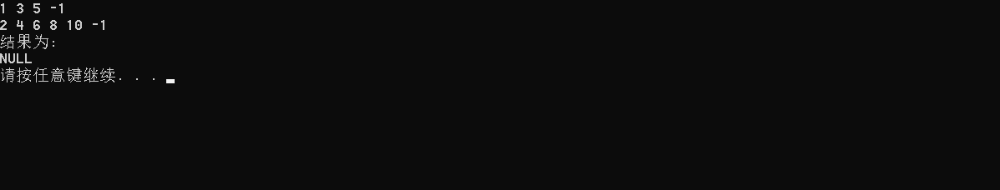
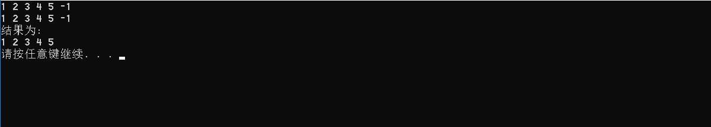
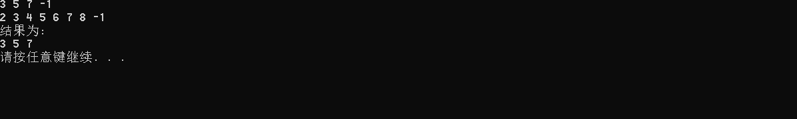
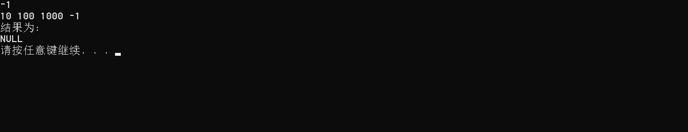

# 数据结构课程设计

#### 

## 两个有序链表序列的交集项目说明文档

### 0.项目简介
- 项目内容
已知两个非降序链表序列S1和S2，设计函数构造出S1和S2的交集新链表S3。

- 项目功能要求：(采用链表)
1. 输入说明：输入分2行，分别在每行给出由若干个正整数构成的非降序序列，用-1表示序列的结尾（-1不属于这个序列）。数字用空格间隔。
2. 输出说明：在一行中输出两个输入序列的交集序列，数字间用空格分开，结尾不能有多余空格；若新链表为空，输出NULL。

### 1.核心代码
#### 解释说明
**对a链和b链各自创建指针pa，pb，结果存在新链c上，a链和b链数据相等则给新链添加新项，a链和b链指针后移。a链值大则b链指针后移，b链值大则a链指针后移。**

#### 源码
```c++
friend List * intersection(List * a, List * b) {
		List * c = new List();
		LinkNode * pc = c->sentinal;
		LinkNode * pa = a->sentinal->link;
		LinkNode * pb = b->sentinal->link;
		while (pa != NULL && pb != NULL) {
			if (pa->data == pb->data) {
				pc->link = new LinkNode(pa->data);
				pc = pc->link;
				pa = pa->link;
				pb = pb->link;
			}
			else if (pa->data > pb->data) {
				pb = pb->link;
			}
			else {
				pa = pa->link;
			}
		}
		return c;
	}
```

### 2.项目效果
- 一般情况


- 交集为空的情况


- 完全相交的情况


- 其中一个序列完全属于交集的情况


- 其中一个序列为空的情况



### 3. 类及类成员介绍

- #### LinkNode类  

  - ##### 成员变量
  |成员名称|属性|类型|描述|
  |--------|---|---|----|
  |data|public|int|节点数据|
  |link|public|LinkNode * |指向下一个节点指针|

	
  - ##### 成员函数  
  |函数名称|返回值类型|描述|
  |--------|--------|----|
  |LinkNode|无|构造函数|

- #### List类  

  - ##### 成员变量
  |成员名称|属性|类型|描述|
  |--------|---|---|----|
  |sentinal|private|LinkNode * |表头结点|

	
  - ##### 成员函数  
  |函数名称|返回值类型|描述|
  |--------|--------|----|
  |List|无|构造函数|
  |~List|无|析构函数|
  |build|void|建立链表|

  - ##### 友元函数
  |函数名称|返回值类型|描述|
  |--------|--------|----|
  |output|void|输出链表|
  |~List|无|析构函数|
  |intersection|List * |求两链表交集|

### 4.类的实现
- #### LinkNode类的实现
```c++
class LinkNode {
public:
	int data;
	LinkNode * link;
	LinkNode() :link(NULL) {}
	LinkNode(int data_) : data(data_), link(NULL) {}
};
```
- #### List类的实现
```c++
class List {
private:
	LinkNode * sentinal;
	
		
public:
	List() {
		sentinal = new LinkNode();
	}
	~List() {
		LinkNode * p = sentinal;
		while (p->link != NULL) {
			LinkNode * tmp = p;
			p = p->link;
			delete p;
		}

	}
	void build() {
		LinkNode * p = sentinal;
		int data;
		cin >> data;
		while(data != -1) {
			p->link = new LinkNode(data);
			p = p->link;
			cin >> data;
		}
	}
};
```