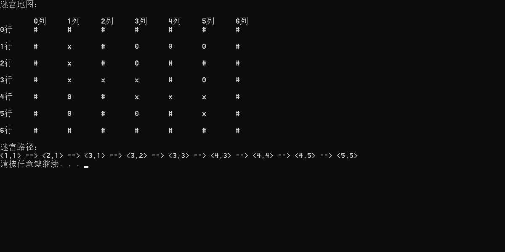
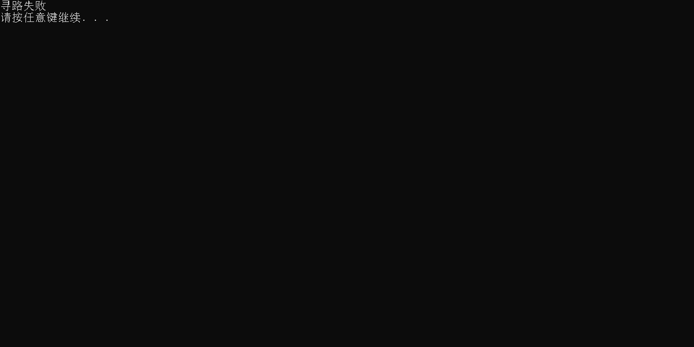

# 数据结构课程设计

#### 

## 勇闯迷宫游戏项目说明文档

### 0.项目简介
项目简介：
迷宫只有两个门，一个门叫入口，另一个门叫出口。一个骑士骑马从入口进入迷宫，迷宫设置很多障碍，骑士需要在迷宫中寻找通路以到达出口。

- 项目功能要求：
迷宫问题的求解过程可以采用回溯法即在一定的约束条件下试探地搜索前进，若前进中受阻，则及时回头纠正错误另择通路继续搜索的方法。从入口出发，按某一方向向前探索，若能走通，即某处可达，则到达新点，否则探索下一个方向；若所有的方向均没有通路，则沿原路返回前一点，换下一个方向再继续试探，直到所有可能的道路都探索到，或找到一条通路，或无路可走又返回入口点。在求解过程中，为了保证在达到某一个点后不能向前继续行走时，能正确返回前一个以便从下一个方向向前试探，则需要在试探过程中保存所能够达到的每个点的下标以及该点前进的方向，当找到出口时试探过程就结束了。


### 1.核心代码
#### 解释说明
根据题意可以看出这是一个有关搜索的题目，并且这可以算是一个深度优先搜索的题目，其中DFS中的一个重要的思想就是回溯，利用回溯的话是非常适合解决这类题目的。

上交的程序中我使用了默认地图
#### 源码
```c++
bool seekPath(pos begin, pos end) {
	if (begin.x == end.x && begin.y == end.y) {
		maze[begin.x][begin.y] = 'x';
		path_seq.push(begin);
		return true;
	}
	pos cur = begin;
	maze[cur.x][cur.y] = 'x';
	path_seq.push(cur);
	bool isSucceed = false;
	for (int i = 0; i < 4; i++) {
		if (maze[cur.x + direc[i].x][cur.y + direc[i].y] == '0') {
			pos next;
			next.x = cur.x + direc[i].x;
			next.y = cur.y + direc[i].y;
			isSucceed = isSucceed || seekPath(next, end);
		}
	}
	if (isSucceed == false) {
		maze[cur.x][cur.y] = '0';
		path_seq.pop();
		return false;
	}
	else {
		return true;
	}
}
```

### 2.项目效果


### 3.重要变量
```c++
//地图
char maze[7][7] = {
{'#','#','#','#','#','#','#'},
{'#','0','#','0','0','0','#'},
{'#','0','#','0','#','#','#'},
{'#','0','0','0','#','0','#'},
{'#','0','#','0','0','0','#'},
{'#','0','#','0','#','0','#'},
{'#','#','#','#','#','#','#'},
};
//坐标结构体
typedef struct pos {
	int x;
	int y;
} pos;
//方向数组
pos direc[4] = { {0,1},{0,-1},{1,0},{-1,0} };
//保存迷宫路径，用于结束时输出
queue<pos> path_seq;


```
### 4.重要函数
#### 迷宫输出函数
```c++
		cout << "迷宫地图：" << endl << endl;
		cout << "   " << '\t';
		for (int i = 0; i < 7; i++) {
			cout << i << "列" << '\t';
		}
		cout << endl;
		for (int i = 0; i < 7; i++) {
			cout << i << "行" << '\t';
			for (int j = 0; j < 7; j++) {
				cout << maze[i][j] << '\t';
			}
			cout << endl << endl;
		}
```
#### 路径输出函数
```c++
		int flag = 0;
		cout << "迷宫路径："<< endl;
		while (!path_seq.empty()) {
			if (flag) {
				cout << " --> ";
			}
			cout << '<'<<path_seq.front().x <<','<< path_seq.front().y << '>';
			path_seq.pop();
			flag = 1;
		}
		cout << endl;
```

### 5.容错测试
**本来终点设置了 `pos end = { 5,5 };`我们改为` pos end = { 5,4 };`,地图中是有障碍物#占据的，运行结果符合设计**


