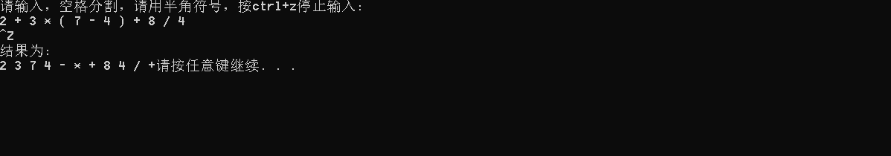
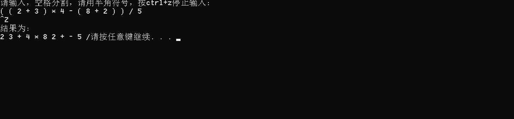
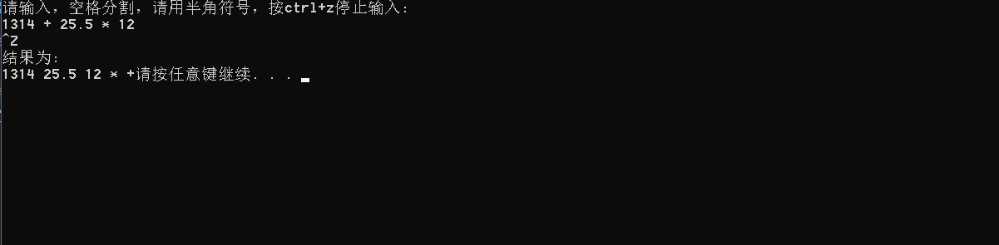
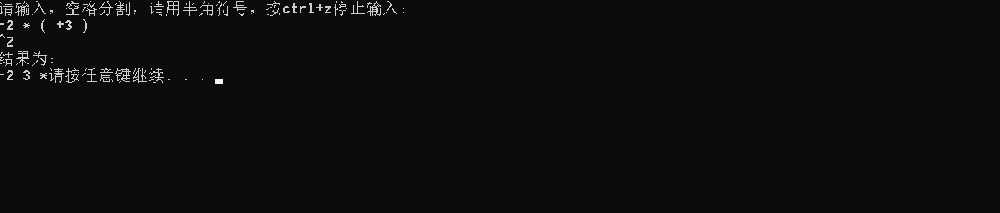
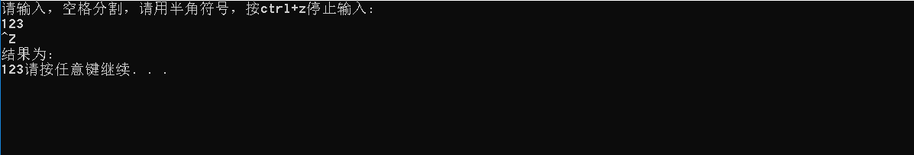

# 数据结构课程设计

#### 

## 表达式转换项目说明文档

### 0.项目简介
算数表达式有前缀表示法，中缀表示法和后缀表示法等形式。日常使用的算术表达式是采用中缀表示法，即二元运算符位于两个运算数中间。请设计程序将中缀表达式转换成为后缀表达式。

- 项目要求：
1. 输入说明：输入在一行中给出以空格分隔不同对象的中缀表达式，可包含+, -, *, /, -, *, /以及左右括号，表达式不超过20个字符（不包括空格）。
2. 输出说明：在一行中输出转换后的后缀表达式，要求不同对象（运算数，运算符号）之间以空格分隔，但是结尾不得有多余空格。
3. 测试用例
2 + 3 * ( 7 - 4 ) + 8 / 4
( ( 2 + 3 ) * 4 - ( 8 + 2 ) ) / 5
1314 + 25.5 * 12
-2 * ( +3 )
123

### 1.核心代码
#### 解释说明
整体思路：
2.2）实例
规则很多，还是用实例比较容易说清楚整个过程。以输入为a + b * c + (d * e + f)*g，处理过程如下：
1）首先读到a，直接输出。
2）读到“+”，将其放入到栈中。
3）读到b，直接输出。
此时栈和输出的情况如下
4）读到“*”，因为栈顶元素"+"优先级比" * " 低，所以将" * "直接压入栈中。
5）读到c，直接输出。
此时栈和输出情况如下：
6）读到" + "，因为栈顶元素" * "的优先级比它高，所以弹出" * "并输出， 同理，栈中下一个元素" + "优先级与读到的操作符" + "一样，所以也要弹出并输出。然后再将读到的" + "压入栈中。
此时栈和输出情况如下：
7）下一个读到的为"("，它优先级最高，所以直接放入到栈中。
8）读到d，将其直接输出。
此时栈和输出情况如下：
9）读到" * "，由于只有遇到" ) "的时候左括号"("才会弹出，所以" * "直接压入栈中。
10）读到e，直接输出。
此时栈和输出情况如下：
11）读到" + "，弹出" * "并输出，然后将"+"压入栈中。
12）读到f，直接输出。
此时栈和输出情况
13）接下来读到“）”，则直接将栈中元素弹出并输出直到遇到"("为止。这里右括号前只有一个操作符"+"被弹出并输出。
14）读到" * "，压入栈中。读到g，直接输出。
15）此时输入数据已经读到末尾，栈中还有两个操作符“*”和" + "，直接弹出并输出。
#### 源码
```c++
map<string, int> opera_pri = { {"+",1},{"-",1},{"*",2},{"/",2},{"(",3},{")",3} };
	stack<string> opera_stack;
	string input[25];
	int total = 0;
	cout << "请输入，空格分割，请用半角符号，按ctrl+z停止输入:" << endl;
	while (cin >> input[total]) {
		total++;
	}
	cout << "结果为:" << endl;
	for (int i = 0; i < total; i++) {
		//首位是数字或者长度大于零的string判断为数字
		if (isdigit(input[i][0]) || input[i].size() > 1) {
			output(stod(input[i]));
		}
		else  if (opera_pri.count(input[i]) > 0) {
			if (input[i] == "(") {
				opera_stack.push(input[i]);
			}
			else if (input[i] == ")") {
				while (opera_stack.peek() != "(") {
					output(opera_stack.pop());
				}
				opera_stack.pop();
			}
			else if (!opera_stack.isEmpty()) {
				//左括号特殊处理是因为其优先级本来是高的，但不符合一般情况
				if (opera_stack.peek() == "(" || opera_pri[input[i]] > opera_pri[opera_stack.peek()]) {
					opera_stack.push(input[i]);
				}
				else {
					while (!opera_stack.isEmpty() && opera_stack.peek() != "(" &&(opera_pri[input[i]] <= opera_pri[opera_stack.peek()])) {
						output(opera_stack.pop());
					}
					opera_stack.push(input[i]);
				}
			} else if(opera_stack.isEmpty()){
				opera_stack.push(input[i]);
			}

		}
	}
	//输出还留在栈里的符号
	while (!opera_stack.isEmpty()) {
		output(opera_stack.pop());
	}
```
### 2.项目效果
- 正常测试六种运算符


- 嵌套括号


- 运算数超过1位整数且有非整数出现


- 运算数有正或负号


- 只有1个数字




### 3. 类及类成员介绍

- #### stack类  

  - ##### 成员变量
  | 成员名称 | 属性   | 类型       | 描述               |
  | -------- | ------ | ---------- | ------------------ |
  | size     | private | int        | 栈的大小           |
  | elements    | private | T[] | 存数据的数组 |

  - ##### 成员函数  
  | 函数名称 | 返回值类型 | 描述     |
  | -------- | ---------- | -------- |
  | stack | 无         | 构造函数 |
  | isFull | bool         | 判断是否为满 |
  | isEmpty | bool         | 判断是否为空 |
  | Totalsize | int         | 返回栈的大小 |
  | push | bool         | 进栈 |
  | pop | T         | 出栈 |
  | peek | T        | 获取栈顶元素 |

### 4.类的实现
```c++
template <class T>
class stack {
private:
	int size;
	T elements[50];
public:
	stack() : size(0) {};
	bool isFull() {
		return size == 50;
	}
	bool isEmpty() {
		return size == 0;
	}
	int Totalsize() {
		return size;
	}
	bool push(T elem) {
		if (isFull()) {
			return false;
		}
		elements[size] = elem;
		size++;
		return true;
	}
	T pop() {
		if (isEmpty()) {
			return NULL;
		}
		T elem = elements[size - 1];
		size--;
		return elem;
	}
	T peek() {
		if (isEmpty()) {
			return NULL;
		}
		return elements[size - 1];
	}
};
```
