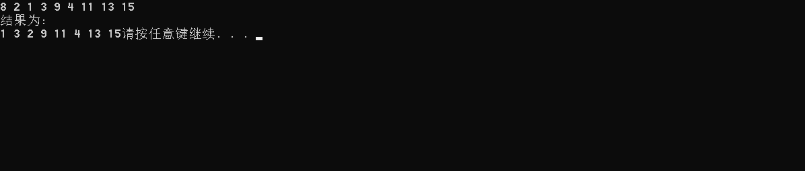
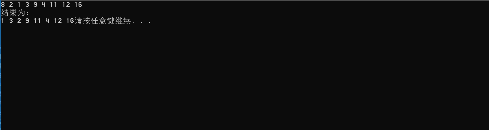
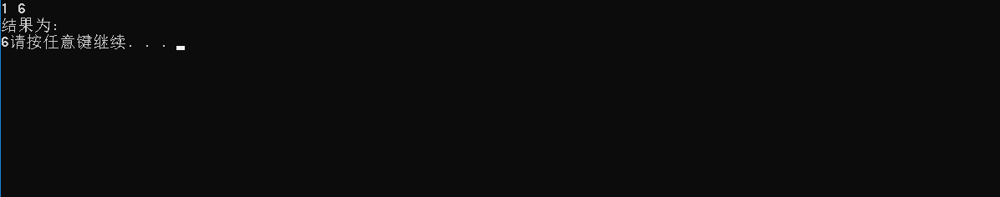

# 数据结构课程设计

#### 作者：1652613 白皓月

## 银行业务项目说明文档

### 0.项目简介
设某银行有A，B两个业务窗口，且处理业务的速度不一样，其中A窗口处理速度是B窗口的2倍----即当A窗口每处理完2个顾客是，B窗口处理完1个顾客。给定到达银行的顾客序列，请按照业务完成的顺序输出顾客序列。假定不考虑顾客信后到达的时间间隔，并且当不同窗口同时处理完2个顾客时，A窗口的顾客优先输出。

- 项目功能要求
1. 输入说明：输入为一行正整数，其中第一数字N（N<=1000）为顾客总数，后面跟着N位顾客的编号。编号为奇数的顾客需要到A窗口办理业务，为偶数的顾客则去B窗口。数字间以空格分隔。
2. 输出说明：按照业务处理完成的顺序输出顾客的编号。数字键以空格分隔，但是最后一个编号不能有多余的空格。
3. 测试用例：
8 2 1 3 9 4 11 13 15
8 2 1 3 9 4 11 12 16
1 6 

### 1.核心代码
#### 解释说明
很明显这个题在考队列，刚开始想在一个队列里实现这个过程，最后发现不太现实。所以还是决定创建两个队列 A和B，分别统计奇数和偶数个数（也就是统计A窗口和B窗口的人数）。既然是不考虑顾客先后到达的时间间隔的话，那就统一输出就可以了。（这个题其实好懂，唯一的难点就在于要想清楚如何输出）。
输出的话，设置计时器，每回递加A都pop输出，B只有递加两次才pop输出一次

#### 源码
```c++
int total;
	cin >> total;
	myqueue queueA, queueB;
	for (int i = 0; i < total; i++) {
		int id;
		cin >> id;
		if (id % 2 == 1) {
			queueA.push(id);
		}
		else {
			queueB.push(id);
		}
	}
	int time = 1;
	int isBegin = 1;
	while (!queueA.isEmpty() || !queueB.isEmpty()) {
		
		if (!queueA.isEmpty()) {
			if (!isBegin) cout << ' ';
			cout << queueA.pop();
			isBegin = 0;
		}
		if (time % 2 == 0) {	
			if (!queueB.isEmpty()) {
				if (!isBegin) cout << ' ';
				cout << queueB.pop();
				isBegin = 0;
			}
		}
		time++;
	}
```
### 2.项目效果
- 正常测试，A窗口人多


- 正常测试，B窗口人多


- 最小N



### 3. 类及类成员介绍

- #### myqueue类  

  - ##### 成员变量
  | 成员名称 | 属性   | 类型       | 描述               |
  | -------- | ------ | ---------- | ------------------ |
  | size     | private | int        | 队列的大小           |
  | elements    | private | int[] | 存数据的数组 |
  | front    | private | int | 指向队头 |
  | tail    | private | int | 指向队尾后的位置 |

  - ##### 成员函数  
  | 函数名称 | 返回值类型 | 描述     |
  | -------- | ---------- | -------- |
  | muqueue | 无         | 构造函数 |
  | isFull | bool         | 判断是否为满 |
  | isEmpty | bool         | 判断是否为空 |
  | push | bool         | 进队列 |
  | pop | T         | 出队列 |

### 4.类的实现
```c++
class myqueue {
private:
	int size;
	int elements[10];
	int front;
	int tail;
public:
	myqueue() : size(0), front(0), tail(0) {};
	bool isEmpty() {
		return size == 0;
	}
	bool isFull() {
		return size == 10;
	}
	bool push(int ele) {
		if (isFull()) {
			return false;
		}
		elements[tail] = ele;
		size++;
		tail = (tail + 1) % 10;
		return true;
	}
	int pop() {
		if (isEmpty()) {
			return NULL;
		}
		size--;
		int res = elements[front];
		front = (front + 1) % 10;
		return res;
	}
		
};
```
