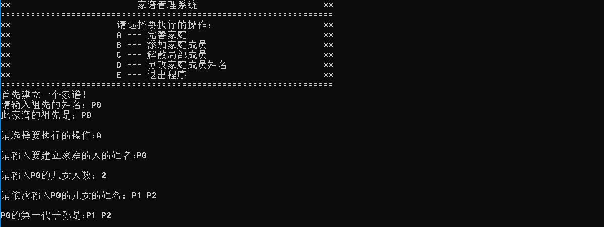
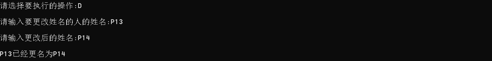

# 数据结构课程设计

#### 作者：1652613 白皓月

## 家谱管理系统项目说明文档

### 0.项目简介
家谱是一种以表谱形式，记载一个以血缘关系为主体的家族世袭繁衍和重要任务事迹的特殊图书体裁。家谱是中国特有的文化遗产，是中华民族的三大文献（国史，地志，族谱）之一，属于珍贵的人文资料，对于历史学，民俗学，人口学，社会学和经济学的深入研究，均有其不可替代的独特功能。本项目兑对家谱管理进行简单的模拟，以实现查看祖先和子孙个人信息，插入家族成员，删除家族成员的功能。

- 项目功能要求：
本项目的实质是完成兑家谱成员信息的建立，查找，插入，修改，删除等功能，可以首先定义家族成员数据结构，然后将每个功能作为一个成员函数来完成对数据的操作，最后完成主函数以验证各个函数功能并得到运行结果。

### 1.项目实现
- 完善家谱

```c++
void completeFamily(Tree * family) {
	string name;
	cout << "请输入要建立家庭的人的姓名:" ;
	cin >> name;
	cout << endl;
	TreeNode * p = family->find(family->root_(), name);
	if (p == NULL) {
		cout << "未找到此人" << endl;
		return;
	}
	if (p->child) {
		cout << p->data << "已经建立过家庭" << endl;
		return;
	}
	cout << "请输入" << p->data << "的儿女人数：" ;
	int child_num = 0;
	cin >> child_num;
	cout << endl;
	cout << "请依次输入" << p->data << "的儿女的姓名：";
	for (int i = 0; i < child_num; i++) {
		cin >> name;
		family->insert(p, name);
	}
	cout << endl;
	family->showChildren(p);
	cout << endl;
}
```



- 添加家庭成员

```c++
void insertFamily(Tree * family) {
	string name;
	cout << "请输入要添加儿子（或女儿）的人的姓名：";
	cin >> name;
	TreeNode * p = family->find(family->root_(), name);
	if (p == NULL) {
		cout << "未找到此人" << endl;
		return;
	}
	cout << endl;
	cout << "请输入" << p->data << "新添加的儿子（或女儿的姓名）：";
	cin >> name;
	cout << endl;
	family->insert(p, name);
	family->showChildren(p);
	cout << endl;
}
```


- 解散局部家庭

```c++
void deleteFamily(Tree * family) {
	string name;
	cout << "请输入要解散家庭的人的姓名：" ;
	cin >> name;
	cout << endl;
	TreeNode * p = family->find(family->root_(), name);
	if (p == NULL) {
		cout << "查无此人" << endl;
		return;
	}
	cout << "要解散家庭的人是：" << name << endl;
	family->showChildren(p);
	family->del_family(p);
	//family->showChildren(p);
	cout << endl;
}
```


- 更改家庭成员姓名

```c++
void changeMember(Tree * family) {
	string name;
	cout << "请输入要更改姓名的人的姓名:" ;
	cin >> name;
	cout << endl;
	TreeNode * p = family->find(family->root_(), name);
	if (p == NULL) {
		cout << "查无此人" << endl;
		cout << endl;
		return;
	}
	cout << "请输入更改后的姓名:";
	cin >> p->data;
	cout << endl;
	cout << name << "已经更名为" << p->data << endl;
	cout << endl;
}
```


- 退出程序


### 2. 类及类成员介绍

- #### TreeNode类  

  - ##### 成员变量
  | 成员名称 | 属性   | 类型       | 描述               |
  | -------- | ------ | ---------- | ------------------ |
  | data     | public | string        | 节点数据（姓名)           |
  | child    | public | TreeNode * | 指向子女的指针 |
  | sibling    | public | TreeNode * | 指向兄弟的指针 |

  - ##### 成员函数  
  | 函数名称 | 返回值类型 | 描述     |
  | -------- | ---------- | -------- |
  | TreeNode | 无         | 构造函数 |

- #### Tree类  

  - ##### 成员变量
  | 成员名称 | 属性   | 类型       | 描述               |
  | -------- | ------ | ---------- | ------------------ |
  | root     | private | int        | 数根          |

  - ##### 成员函数  
  | 函数名称 | 返回值类型 | 描述     |
  | -------- | ---------- | -------- |
  | Tree | 无         | 构造函数 |
  | ~Tree | 无         | 析构函数 |
  | del_sibling | void         | 删除一个节点的所有兄弟 |
  | root _ | TreeNode *          | 返回树根 |
  | create | void         | 建树根 |
  | find | TreeNode *         | 找data为某一内容的节点 |
  | change | bool         | 更改某一个成员姓名 |
  | insert | bool         | 将某一子女插入其父亲的家庭 |
  | del_family | bool         | 删除某一成员的所有子女 |
  | showChildren| void         | 输出某一成员所有子女 |


### 3.类的实现
- #### TreeNode的实现

```c++
class TreeNode {
public:
	string data;
	TreeNode * child;
	TreeNode * sibling;
	TreeNode() : data(""), child(NULL), sibling(NULL) {}
	TreeNode(string name) : data(name), child(NULL), sibling(NULL) {}
};
```
- #### Tree的实现

```c++
class Tree {
	
private:
	//删除一个节点的所有兄弟 
	void del_sibling(TreeNode *&p) {
		if (p != NULL) {
			del_sibling(p->sibling);
			delete p;
			p = NULL;
		}
	}
	TreeNode * root;
public:
	Tree() : root(NULL) {};
	//返回树根
	TreeNode * root_() {
		return root;
	}
	~Tree() {
		del_family(root);
	}
	//建树根
	void create(string name) {
		root = new TreeNode(name);
	}
	//找data为某一内容的节点
	TreeNode * find(TreeNode * p, string name) {
		if (p == NULL) return NULL;
		if (p->data == name) {
			return p;
		}
		else {
			TreeNode * res = find(p->child, name);
			if (res != NULL) {
				return res;
			}
			else {
				return find(p->sibling, name);
			}
		}
	}
	//将某一子女插入其父亲的家庭
	bool insert(TreeNode * parent, string child) {
		TreeNode * p = parent;
		if (p == NULL) return false;
		if (p->child == NULL) {
			p->child = new TreeNode(child);
		}
		else {
			p = p->child;
			while (p->sibling != NULL) {
				p = p->sibling;
			}
			p->sibling = new TreeNode(child);
		}
		return true;
	}
	//更改某一个成员姓名
	bool change(string oldname, string newname) {
		TreeNode * p = find(root, oldname);
		if (p == NULL) return false;
		p->data = newname;
		return true;
	}
	//删除某一成员的所有子女
	bool del_family(TreeNode * parent) {
		TreeNode * p = parent;
		if (p == NULL) return false;
		del_sibling(p->child);
		return true;
	}
	//输出某一成员所有子女
	void showChildren(TreeNode * parent) {
		if (parent->child == NULL) {
			cout << parent->data << "没有子女" << endl;
		}
		else {
			TreeNode * p = parent->child;
			cout << parent->data << "的第一代子孙是:";
			while (p != NULL) {
				cout << p->data << ' ' ;
				p = p->sibling;
			}
			cout << endl;
		}
	}
};
```


