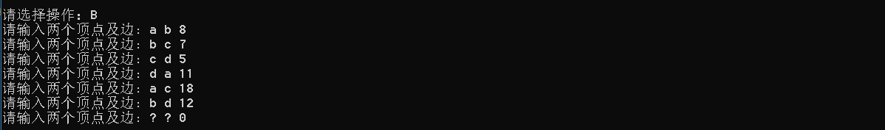

# 数据结构课程设计

#### 作者：1652613 白皓月

## 电网建设造价模拟系统项目说明文档

### 0.项目简介
假设一个城市有n个小区，要实现n个小区之间的电网都能够相互接通，构造这个城市n个小区之间的电网，使总工程造价最低。请设计一个能够满足要求的造价方案。

- 项目功能要求：
在每个小区之间都可以设置一条电网线路，都要付出相应的经济代价。n个小区之间最多可以有n（n-1）/2条线路，选择其中的n-1条使总的耗费最少。

### 1.项目实现
- 创建电网顶点

```c++
	void createVertex() {
		cout << "请依次输入各顶点的名称：" << endl;
		for (int i = 0; i < v; i++) {
			cin >> NodeTable[i].data;
			findVertex[NodeTable[i].data] = i;
		}
	}
```

- 添加电网的边

```c++
	void createEdge() {	
		string v1data, v2data;
		int weight;
		cout << "请输入两个顶点及边: ";
		cin >> v1data >> v2data >> weight;
		while (v1data != "?") {
			int v1 = findVertex[v1data];
			int v2 = findVertex[v2data];
			insertEdge(v1, v2, weight);
			cout << "请输入两个顶点及边: ";
			cin >> v1data >> v2data >> weight;
		}
	}
	void insertEdge(int v1, int v2, int weight) {
		Edge * e_v1 = new Edge(v1,v2, weight, NodeTable[v1].adj);
		Edge * e_v2 = new Edge(v2,v1, weight, NodeTable[v2].adj);
		NodeTable[v1].adj = e_v1;
		NodeTable[v2].adj = e_v2;
		e++;
	}
```


- 构造最小生成树

```c++
	Prime(Graph & G,string begin) {
		marked = new bool[G.getV()];
		for (int i = 0; i < G.getV(); i++) {
			marked[i] = false;
		}
		visit(G, G.findVertex[begin]);
		while (!pq.empty()) {
			Edge e = pq.top();
			pq.pop();
			int v = e.either, w = e.other;
			if (marked[v] && marked[w]) continue;
			mst.push_back(e);
			if (!marked[v]) visit(G, v);
			if (!marked[w]) visit(G, w);
		}
		cout << "生成Prim最小生成树！" << endl;
	}
```


- 显示最小生成树

```c++
	void output(Graph &G) {
		cout << "最小生成树的的顶点及边为：" << endl;
		cout << endl;
		for (int i = 0; i < mst.size(); i++) {
			cout << G.nodeData(mst[i].either) << "<-("<<mst[i].cost 		<<")->"<< G.nodeData(mst[i].other) << '\t';
		}
		cout << endl;
	}
```


- 退出程序


### 2. 类及类成员介绍
- #### Edge类  
  - ##### 成员变量
  | 成员名称 | 属性   | 类型       | 描述               |
  | -------- | ------ | ---------- | ------------------ |
  | either    | public | int        | 边的一个顶点           |
  | other    | public | int | 边的另一个顶点 |
  | cost    | public | int | 边的权重 |
  | link    | public | Edge * | 下一条边链指针 |

  - ##### 成员函数  
  | 函数名称 | 返回值类型 | 描述     |
  | -------- | ---------- | -------- |
  | Edge | 无         | 构造函数 |

- #### Vertex类
  - ##### 成员变量
  | 成员名称 | 属性   | 类型       | 描述               |
  | -------- | ------ | ---------- | ------------------ |
  | data     | public | string        | 节点数据         |
  | adj    | public | Edge * | 边链表 |

  - ##### 成员函数  
  | 函数名称 | 返回值类型 | 描述     |
  | -------- | ---------- | -------- |
  | Vertex | 无         | 构造函数 |


- #### Graph类  （无向图）

  - ##### 成员变量
  | 成员名称 | 属性   | 类型       | 描述               |
  | -------- | ------ | ---------- | ------------------ |
  | v    | private | int        | 节点个数          |
  | e     | private | int        | 边的个数          |
  | NodeTable     | private | Vertex *        | 顶点表          |
  | findVertex     | public | map<string,int> | 顶点的数据和索引的对应          |

  - ##### 成员函数  
  | 函数名称 | 返回值类型 | 描述     |
  | -------- | ---------- | -------- |
  |Graph| 无         | 构造函数 |
  | ~Graph | 无         | 析构函数 |
  | createVertex | void         | 创建顶点 |
  | createEdge | void          | 创建边 |
  | insertEdge | void         | 指定两个顶点之间插入边 |
  | output | void         | 输出 |
  | getV | int         |获取顶点个数 |
  | getE | int         | 获取边的个数 |
  | adj | Edge *         | 获取指定顶点的边链表 |
  | nodeData| string         | 获取指定顶点的数据 |

- #### Prime类  

  - ##### 成员变量
  | 成员名称 | 属性   | 类型       | 描述               |
  | -------- | ------ | ---------- | ------------------ |
  | marked   | private | bool *     | 标志顶点是否被访问过的数组       |
  | pq     | private|priority_queue<Edge>，vector<Edge>,cmp>    | 按照边的权重存边的优先队列          |
  | mst    | private | vector<Edge>        | 最小生成树的边集合          |

  - ##### 成员函数  
  | 函数名称 | 返回值类型 | 描述     |
  | -------- | ---------- | -------- |
  |Prime| 无         | 构造函数 |
  | ~Prime | 无         | 析构函数 |
  |visit | void         | 访问指定顶点 |
  |output | void          | 输出最小生成树 |

### 2. 类的实现
- #### Edge类的实现

```c++
struct Edge {
	int either;
	int other;
	int cost;
	Edge * link;
	Edge(int either_,int other_, int cost_,Edge * link_) :either(either_),other(other_), cost(cost_), link(link_) {}
};
```
- #### Vertex类的实现

```c++
struct Vertex {
	string data;
	Edge * adj;
	Vertex() :data(""), adj(NULL) {}
};
```

- #### Graph类的实现（无向图）

```c++
class Graph {
private:
	//节点个数
	int v;
	//边的个数
	int e;
	// 顶点表
	Vertex * NodeTable;
public:
	//顶点的数据和索引的对应 
	map<string, int> findVertex;
	Graph() : v(0), e(0), NodeTable(NULL) {}
	Graph(int sz) {
		v = sz;
		NodeTable = new Vertex[v];
	}
	~Graph() {
		for (int i = 0; i < v; i++) {
			Edge * p = NodeTable[i].adj;
			while (p != NULL) {
				Edge * tmp = p;
				p = p->link;
				delete tmp;
			}
		}
	}
	//创建顶点
	void createVertex() {
		cout << "请依次输入各顶点的名称：" << endl;
		for (int i = 0; i < v; i++) {
			cin >> NodeTable[i].data;
			findVertex[NodeTable[i].data] = i;
		}
	}
	//创建边
	void createEdge() {	
		string v1data, v2data;
		int weight;
		cout << "请输入两个顶点及边: ";
		cin >> v1data >> v2data >> weight;
		while (v1data != "?") {
			int v1 = findVertex[v1data];
			int v2 = findVertex[v2data];
			insertEdge(v1, v2, weight);
			cout << "请输入两个顶点及边: ";
			cin >> v1data >> v2data >> weight;
		}
	}
	//指定两个顶点之间插入边
	void insertEdge(int v1, int v2, int weight) {
		Edge * e_v1 = new Edge(v1,v2, weight, NodeTable[v1].adj);
		Edge * e_v2 = new Edge(v2,v1, weight, NodeTable[v2].adj);
		NodeTable[v1].adj = e_v1;
		NodeTable[v2].adj = e_v2;
		e++;
	}
	//输出
	void output() {
		for (int i = 0; i < v; i++) {
			cout << NodeTable[i].data;
			Edge * p = NodeTable[i].adj;
			while (p != NULL) {
				cout << p->cost << NodeTable[p->other].data << ' ';
				p = p->link;
			}
			cout << endl;
		}
	}
	//获取顶点个数
	int getV() {
		return v;
	}
	//获取边的个数 
	int getE() {
		return e;
	}
	//获取指定顶点的边链表
	Edge * adj(int v) {
		return NodeTable[v].adj;
	}
	//获取指定顶点的数据
	string nodeData(int v) {
		return NodeTable[v].data;
	}
};
```
- #### Prime类的实现

```c++
class Prime {
private:
	////标志顶点是否被访问过的数组
	bool * marked;
	////按照边的权重存边的优先队列
	priority_queue<Edge,vector<Edge>,cmp> pq;
	// 最小生成树的边集合
	vector<Edge> mst;
	//访问指定顶点
	void visit(Graph & G, int v) {
		marked[v] = true;
		Edge * p = G.adj(v);
		while (p != NULL) {
			if (!marked[p->other]) {
				pq.push(*p);
			}
			p = p->link;
		}
	}
public:
	Prime(Graph & G,string begin) {
		marked = new bool[G.getV()];
		for (int i = 0; i < G.getV(); i++) {
			marked[i] = false;
		}
		visit(G, G.findVertex[begin]);
		while (!pq.empty()) {
			Edge e = pq.top();
			pq.pop();
			int v = e.either, w = e.other;
			if (marked[v] && marked[w]) continue;
			mst.push_back(e);
			if (!marked[v]) visit(G, v);
			if (!marked[w]) visit(G, w);
		}
		cout << "生成Prim最小生成树！" << endl;
	}
	~Prime() {
		delete[] marked;
	}
	//输出最小生成树
	void output(Graph &G) {
		cout << "最小生成树的的顶点及边为：" << endl;
		cout << endl;
		for (int i = 0; i < mst.size(); i++) {
			cout << G.nodeData(mst[i].either) << "<-("<<mst[i].cost <<")->"<< G.nodeData(mst[i].other) << '\t';
		}
		cout << endl;
	}

};
```