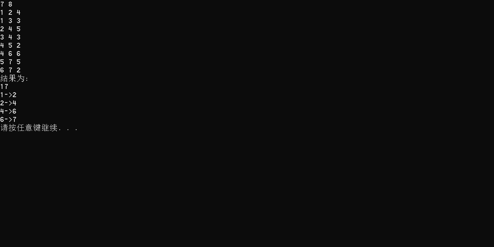
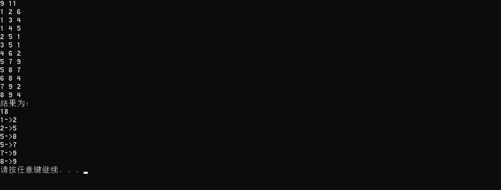

# 数据结构课程设计

#### 作者：1652613 白皓月

## 关键活动项目说明文档

### 0.项目简介
本实验项目是要求在任务调度问题中，如果还给出了完成每个字任务需要的时间，则可以算出完成整个工程项目需要的最短时间。在这些子任务中，有些任务即使推迟几天完成，也不会影响全局的工期；但是有些任务必须准时完成，否则整个项目的工期就要因此而延误，这些任务叫做“关键活动”。
请编写程序判定一个给定的工程项目的任务调度是否可行；如果该调度方案可行，则计算完成整个项目需要的最短时间，并且输出所有的关键活动。

- 项目功能要求：
1. 输入说明：输入第1行给出两个正整数N（N《=100）和M，其中N是任务交接点（即衔接两个项目依赖的两个子任务的结点，例如：若任务2要在任务1完成后才开始，则两个任务之间必有一个交接点）的数量，交接点按1～N编号，M是字任务的数量，依次编号为1～M。随后M行，每行给出3个正整数，分别是该任务开始和完成设计的交接点编号以及完成该任务所需要的时间，整数间用空格分隔。
2. 输出说明：如果任务调度不可行，则输出0；否则第一行输出完成整个项目所需要的时间，第2行开始输出所有关键活动，每个关键活动占一行，按照格式“v->W”输出，其中V和W为该任务开始和完成涉及的交接点编号。关键活动输出的顺序规则是：任务开始的交接点编号小者优先，起点编号相同时，与输入时任务的顺序相反。如下面测试用例2中，任务<5，7>先于任务<5，8>输入，而作为关键活动输出时则次序相反。

### 1.核心代码
```c++
bool topologicalSort(Graph &G) {
	int n = G.getV();
	int top = -1;
	for (int i = 0; i < n; i++) {
		if (G.count[i] == 0) {
			G.count[i] = top;
			top = i;
		}
	}
	int v;
	for (int i = 0; i < n; i++) {
		if (top == -1) {
			return false;
		}
		else {
			v = top;
			top = G.count[top];
			G.nodeData(v) = to_string(i);
			G.findVertex[to_string(i)] = v;
			Edge * p = G.adj(v);
			while (p != NULL) {
				if (--G.count[p->other] == 0) {
					G.count[p->other] = top;
					top = p->other;
				}
				p = p->link;
			}
		}
	}
	return true;
}
void criticalPath(Graph &G) {
	int n = G.getV();
	vector<int > Ve(n);
	vector<int > Vl(n);
	int w;
	for (int i = 0; i < n; i++) {
		Ve[i] = 0;
	}
	for (int i = 0; i < n; i++) {
		int v = G.findVertex[to_string(i)];//找到拓扑顺序对应顶点
		Edge * p = G.adj(v);
		while (p != NULL) {
			w = p->cost;
			if (Ve[v] + w > Ve[p->other]) {
				Ve[p->other] = Ve[v] + w;//核心语句
			}
			p = p->link;
		}
	}
	
	cout << Ve[G.findVertex[to_string(n - 1)]] << endl;
	for (int i = 0; i < n; i++) {
		Vl[i] = Ve[G.findVertex[to_string(n-1)]];
	}
	for (int i = n - 2; i >= 0; i--) {
		int v = G.findVertex[to_string(i)];//找到拓扑逆序对应顶点
		Edge * p = G.adj(v);
		while (p != NULL) {
			w = p->cost;
			if (Vl[p->other] - w < Vl[v]) {
				Vl[v] = Vl[p->other] - w;//核心语句
			}
			p = p->link;
		}
		
	}
	for (int i = 0; i < n; i++) {
		Edge * p = G.adj(i);
		while (p != NULL) {
			w = p->cost;
			int Ae = Ve[i];
			int Al = Vl[p->other] - w;
			if (Ae == Al) {
				cout << i+1 << "->" << p->other+1 << endl; //核心语句
			}
			p = p->link;
		}
		
	}
}
```
### 2.项目效果
- 简单情况测试


- 一般情况测试，单个起点和单个终点


- 不可行的方案测试


### 2. 类及类成员介绍

- #### Edge类  
  - ##### 成员变量
  | 成员名称 | 属性   | 类型       | 描述               |
  | -------- | ------ | ---------- | ------------------ |
  | either    | public | int        | 边的一个顶点           |
  | other    | public | int | 边的另一个顶点 |
  | cost    | public | int | 边的权重 |
  | link    | public | Edge * | 下一条边链指针 |

  - ##### 成员函数  
  | 函数名称 | 返回值类型 | 描述     |
  | -------- | ---------- | -------- |
  | Edge | 无         | 构造函数 |

- #### Vertex类
  - ##### 成员变量
  | 成员名称 | 属性   | 类型       | 描述               |
  | -------- | ------ | ---------- | ------------------ |
  | data     | public | string        | 拓扑排序的顺序        |
  | adj    | public | Edge * | 边链表 |
  **data表示的并非节点数据，此题节点数据正好为数字且等于为索引加一，不另行存储**
  - ##### 成员函数  
  | 函数名称 | 返回值类型 | 描述     |
  | -------- | ---------- | -------- |
  | Vertex | 无         | 构造函数 |


- #### Graph类 （有向图）

  - ##### 成员变量
  | 成员名称 | 属性   | 类型       | 描述               |
  | -------- | ------ | ---------- | ------------------ |
  | v    | private | int        | 节点个数          |
  | e     | private | int        | 边的个数          |
  | NodeTable     | private | Vertex *        | 顶点表          |
  | count  | public | int *    |入度数组兼入度为零顶点栈           |
  | findVertex     | public | map<string,int> | 顶点的拓扑顺序和索引的对应          |

  - ##### 成员函数  
  | 函数名称 | 返回值类型 | 描述     |
  | -------- | ---------- | -------- |
  |Graph| 无         | 构造函数 |
  | ~Graph | 无         | 析构函数 |
  | createEdge | void          | 创建边 |
  | insertEdge | void         | 指定两个顶点之间插入边 |
  | output | void         | 输出 |
  | getV | int         |获取顶点个数 |
  | getE | int         | 获取边的个数 |
  | adj | Edge *         | 获取指定顶点的边链表 |
  | nodeData| string         | 获取指定顶点的数据 |

### 3.类的实现
- #### Edge类的实现

```c++
struct Edge {
	int either;
	int other;
	int cost;
	Edge * link;
	Edge(int either_,int other_, int cost_,Edge * link_) :either(either_),other(other_), cost(cost_), link(link_) {}
};
```
- #### Vertex类的实现

```c++
struct Vertex {
	string data;
	Edge * adj;
	Vertex() :data(""), adj(NULL) {}
};
```

- #### Graph类的实现（有向图）

```c++
class Graph {
private:
	//节点个数 
	int v;
	//边的个数   
	int e;
	//顶点表
	Vertex * NodeTable;
public:
	//顶点的拓扑顺序和索引的对应 
	map<string, int> findVertex;
	//入度数组兼入度为零顶点栈
	int *count;
	Graph() : v(0), e(0), NodeTable(NULL) {}
	Graph(int sz) {
		v = sz;
		NodeTable = new Vertex[v];
		count = new int[v];
		for (int i = 0; i < v; i++) {
			count[i] = 0;
		}
	}
	~Graph() {
		for (int i = 0; i < v; i++) {
			Edge * p = NodeTable[i].adj;
			while (p != NULL) {
				Edge * tmp = p;
				p = p->link;
				delete tmp;
			}
		}
		delete[] NodeTable;
	}
	//创建边
	void createEdge(int m) {
		int v1, v2;
		int weight;

		for(int i = 0; i < m; i++) {
			cin >> v1 >> v2 >> weight;
			//索引即顶点，减一存入，输出加一就好
			insertEdge(v1-1, v2-1, weight);

		}
	}
	// 指定两个顶点之间插入边 
	void insertEdge(int v1, int v2, int weight) {
		count[v2]++;
		Edge * e_v1 = new Edge(v1, v2, weight, NodeTable[v1].adj);
		NodeTable[v1].adj = e_v1;
		e++;
	}
	//输出
	void output() {
		for (int i = 0; i < v; i++) {
			cout << i+1;
			Edge * p = NodeTable[i].adj;
			while (p != NULL) {
				cout << p->cost << p->other+1 << ' ';
				p = p->link;
			}
			cout << endl;
		}
	}
	//获取顶点个数
	int getV() {
		return v;
	}
	//获取边的个数
	int getE() {
		return e;
	}
	//获取指定顶点的边链表
	Edge * adj(int v) {
		return NodeTable[v].adj;
	}
	//获取指定顶点的数据
	string & nodeData(int v) {
		return NodeTable[v].data;
	}
};
```

